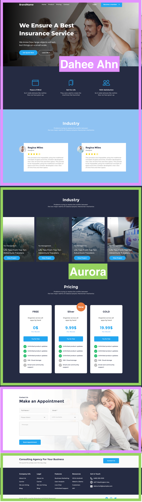

### Introduction

This is the 4th Team Project at Tamwood

### Objective

Practice applying everything you have learned about web development by recreating the website mockup provided here. This mockup is for a single-page website that has responsive design with layout for mobile and laptop/desktop.

### Creator

This design is from https://www.figma.com/community/file/946390947835621236 by [Creator @CaptainDesign](https://www.figma.com/@captaindesign)

### Contributor

What [@daheeahn/Dahee Ahn](https://github.com/daheeahn) and [@aurorar17/Aurora](https://github.com/aurorar17) worked on:

- (This is the original screenshot from Figma)
